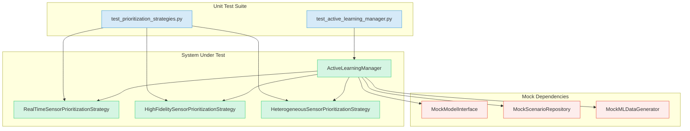

# Unit Test Development Plan: ActiveLearningManager & PrioritizationStrategies

**Date:** 2025-05-23
**Last Updated:** 2025-05-23

**Status:** Unit test implementation for `ActiveLearningManager` and `PrioritizationStrategy` is **complete**. User has confirmed the tests are considered working and this phase of the task is complete. Previous debugging notes are retained for historical context but are superseded by user confirmation.

**Objective:** To create comprehensive unit tests for the `ActiveLearningManager` and its associated `PrioritizationStrategy` implementations, ensuring their correctness and robustness. This will involve creating a new mock component for `MLDataGenerator`.

## Known Issues / Debugging Notes (Historical - Superseded by User Confirmation of Completion)

*   Previous test runs indicated:
    *   `KeyError: 'raw_sample_id'` in `TestRealTimeSensorPrioritizationStrategy` tests.
    *   `FAILURES` in `target_sensor_id` filtering tests across strategies.
    *   Various `ERRORs` in `TestActiveLearningManager` (e.g., `test_initialization_default_strategy_and_map`, `no_export_method` tests).
*   Avro validation errors from `test_data_generator.py` were present in test output but are considered out of scope for this specific unit testing task.

**Note:** The user has confirmed the unit tests are working and this task is complete.

## I. Prerequisite: Create `MockMLDataGenerator`

1.  **File Location:** Add `MockMLDataGenerator` to `envirosense/simulation_engine/ml_training/mock_components.py`. (Completed)
2.  **Class Definition and Initialization:** (Completed)
    *   `class MockMLDataGenerator:`
    *   `__init__(self, default_sample_output: Optional[List[Dict[str, Any]]] = None, default_export_output: Optional[Any] = None)`
        *   ... (details as previously defined) ...
3.  **Method: `generate_training_dataset`** (Completed)
    *   ... (details as previously defined) ...
4.  **Method: `_export_data`** (Completed)
    *   ... (details as previously defined) ...
5.  **Configuration Methods** (Completed)
    *   ... (details as previously defined) ...

## II. Unit Tests for `ActiveLearningManager`

1.  **Test File Location:** `envirosense/simulation_engine/ml_training/tests/test_active_learning_manager.py` (Completed)
2.  **Test Setup (`setUp` method):** (Completed)
3.  **Test Cases:** (Implemented)
    *   `test_initialization`
    *   `test_get_sensor_type_from_id`
    *   `test_identify_weak_spots`
    *   `test_generate_targeted_samples`
    *   `test_suggest_scenario_modifications`
    *   `test_process_real_world_feedback`

## III. Unit Tests for `PrioritizationStrategy` Implementations

1.  **Test File Location:** `envirosense/simulation_engine/ml_training/tests/test_prioritization_strategies.py` (Completed)
2.  **General Tests for `PrioritizationStrategy`:** (Implemented)
3.  **For each concrete strategy (`RealTimeSensorPrioritizationStrategy`, `HighFidelitySensorPrioritizationStrategy`, `HeterogeneousSensorPrioritizationStrategy`):** (Implemented)
    *   `test_initialization`
    *   `test_calculate_priority`
    *   `test_identify_weaknesses`

## IV. Test Structure and Conventions

*   Use Python's `unittest` framework.
*   Use `unittest.mock.Mock` and `unittest.mock.patch`.
*   Clear test method names.
*   Independent tests.

## V. Visualization of Components and Mocks

## VI. Key Considerations

*   **Mock Granularity:** `MockMLDataGenerator` should be simple but controllable.
*   **Data Structures:** `MockModelInterface` data should trigger diverse behaviors.
*   **Focus of Tests:**
    *   `ActiveLearningManager`: Orchestration logic.
    *   `PrioritizationStrategy`: Internal logic for identifying/prioritizing weaknesses.
*   **Clarity of Assertions:** Specific and clear.