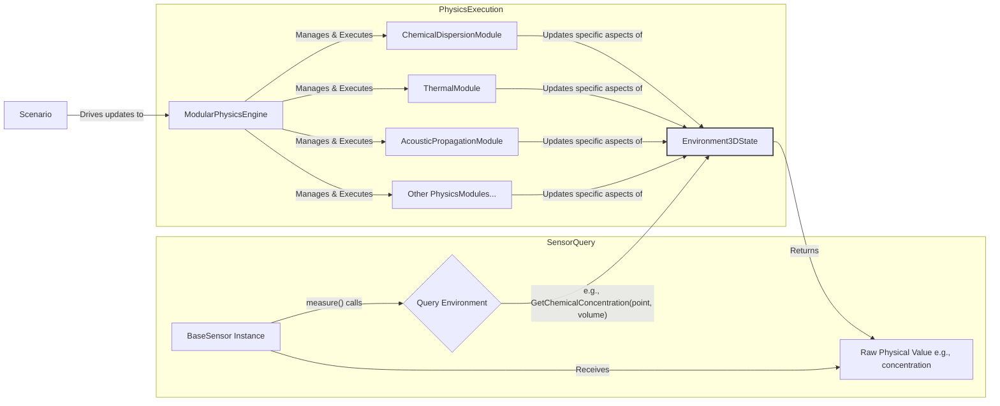
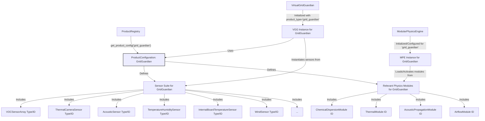
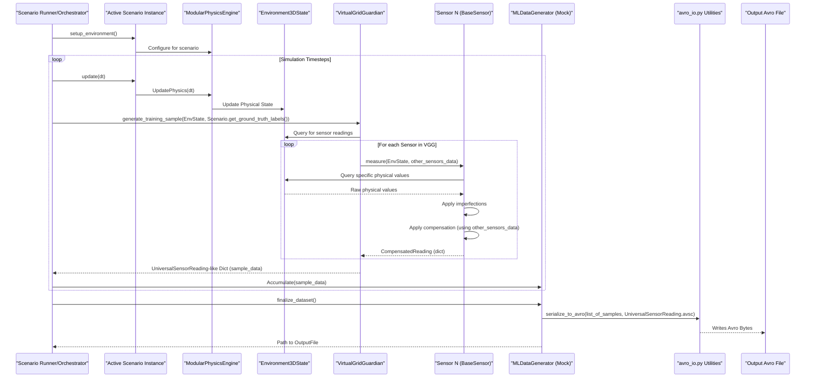
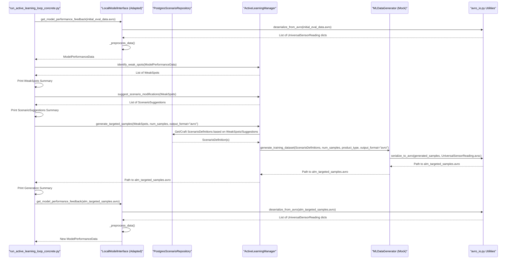
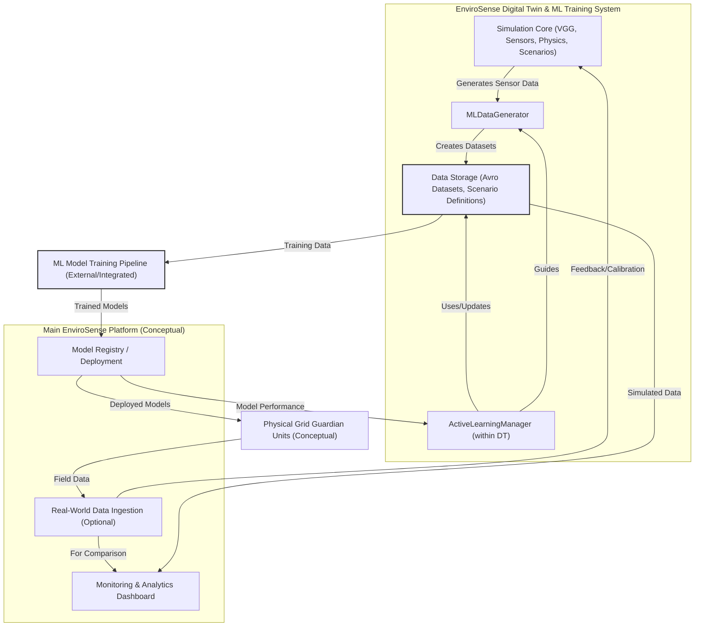

# EnviroSense Scalable Platform Architecture

## 1. Introduction and Scope

This document provides a comprehensive visualization of the proposed scalable EnviroSense platform architecture. Its purpose is to serve as an architectural blueprint for development, ensuring clarity and alignment across all components. The diagrams herein illustrate core components, their interactions, key data structures, links to the physics engine, connections to the Main_Platform (conceptual), and product-specific views (using Grid Guardian as an initial example).

The key architectural views covered include:
*   Overall System Context and High-Level Component Breakdown.
*   Core Simulation Component Interactions and Data Flow.
*   Physics Engine Integration.
*   Product-Specific Configuration and Instantiation.
*   Data Flow for ML Training Data Generation.
*   Active Learning Manager (ALM) Loop within the new architecture.

Mermaid diagrams are used for visualization. Diagrams will indicate key data structures or their important fields where appropriate to clarify data exchange.

## 2. Core Component Interaction Diagram

This diagram illustrates the primary components of the EnviroSense simulation core and how they interact to generate sensor data. It highlights the flow of configuration, environmental state, sensor measurements, and scenario logic.

**Key Components and Interactions:**

*   **Product Configuration Management:**
    *   `ProductRegistry`: A singleton responsible for loading and providing access to product-specific configurations. It loads these from YAML/JSON files (e.g., `/envirosense/config/products/grid_guardian.yaml`).
    *   `ProductConfiguration`: A data structure (likely a dataclass) holding the specific setup for a product, including its `sensor_suite`, applicable `physics_modules`, `ml_models`, and `operational_logic`.

*   **Simulation Core:**
    *   `VirtualGridGuardian (VGG)`: Orchestrates the sensor array for a given product. It's instantiated based on a `ProductConfiguration` obtained from the `ProductRegistry`.
    *   `BaseSensor` Instances (e.g., `VOCSensorArray`, `ThermalCameraSensor`, `AcousticSensor`, and their dependencies like `TemperatureHumiditySensor`, `InternalBoardTemperatureSensor`, `WindSensor`): These are concrete sensor implementations adhering to the new `universal_base_sensor.BaseSensor` interface. The VGG manages these instances.
        *   **Sensor Dependencies & Compensation:** Sensors can declare dependencies on other sensors (e.g., `VOCSensorArray` depends on `TemperatureHumiditySensor`). The `measure()` method of a sensor receives data from `other_sensors` and can use its `apply_compensation()` method to refine its readings.
        *   **Sensor Interaction:** Each active sensor's `measure(env_state, other_sensors)` method is called by the VGG. This method queries the `Environment3DState`, applies internal imperfections, and then applies compensation, returning a dictionary representing its reading (structured to fit into a `SensorReading` part of the `UniversalSensorReading` format).
    *   `Environment3DState (ES)`: Represents the instantaneous physical state of the simulated environment (e.g., chemical concentrations, temperature fields). Sensors query this state.
    *   `ModularPhysicsEngine (MPE)`: Responsible for updating the `Environment3DState` based on active `PhysicsModule`s (e.g., Chemical, Thermal, Acoustic). It's driven by the active scenario.
    *   `BaseScenario (Scen)`: Defines the conditions, events, and evolution of a simulation run. It interacts with the MPE to `setup_environment()` and `update()` the physics. It also provides `get_ground_truth_labels()`.
    *   `ScenarioTemplate (STemp)`: Provides a blueprint for creating concrete `BaseScenario` instances, adaptable to different `product_type`s and parameters.

*   **Data Generation and Output:**
    *   The `VGG`'s `generate_training_sample()` method combines the compensated sensor readings (multiple `SensorReading-like Dicts`) and the `GroundTruthLabels Dict` from the scenario into a comprehensive `UniversalSensorReading-like Dict`.
    *   `MLDataGenerator (Mock)`: Consumes data from `VGG` and `BaseScenario` to produce datasets. In this diagram, it's shown producing an Avro data file formatted according to `UniversalSensorReading.avsc`.

The diagram aims to show the flow: Product Configuration -> VGG Setup -> Scenario-driven Physics Updates -> Sensor Measurement & Compensation -> Aggregated Data Sample -> Dataset Generation.

```mermaid
graph TD
    subgraph "ProductConfigurationManagement"
        PR["ProductRegistry"] --> PC["ProductConfiguration: GridGuardian"];
        PR -- "Loads from" --> ConfigFiles["YAML: .../grid_guardian.yaml"];
    end

    subgraph "SimulationCore"
        VGG["VirtualGridGuardian"] -- "Instantiates based on" --> PC;
        VGG -- "Manages" --> BS1["BaseSensor: VOCSensorArray"];
        VGG -- "Manages" --> BS2["BaseSensor: ThermalCameraSensor"];
        VGG -- "Manages" --> BS3["BaseSensor: AcousticSensor"];
        VGG -- "Manages" --> DepS1["BaseSensor: TemperatureHumiditySensor"];
        VGG -- "Manages" --> DepS2["BaseSensor: InternalBoardTemperatureSensor"];
        VGG -- "Manages" --> DepS3["BaseSensor: WindSensor"];

        BS1 -- "Depends on/Uses for compensation" --> DepS1;
        BS2 -- "Depends on/Uses for compensation" --> DepS2;
        BS3 -- "Depends on/Uses for compensation" --> DepS3;
        
        subgraph "SensorInteraction"
            direction LR;
            BS1 -- "measure(env_state, other_sensors)" --> MeasuredData1["SensorReading-like Dict"];
            BS2 -- "measure(env_state, other_sensors)" --> MeasuredData2["SensorReading-like Dict"];
            BS3 -- "measure(env_state, other_sensors)" --> MeasuredData3["SensorReading-like Dict"];
        end

        VGG -- "Queries/Receives" --> ES["Environment3DState"];
        MPE["ModularPhysicsEngine"] -- "Updates" --> ES;
        MPE -- "Composed of" --> PM1["PhysicsModule: Chemical"];
        MPE -- "Composed of" --> PM2["PhysicsModule: Thermal"];
        MPE -- "Composed of" --> PM3["PhysicsModule: Acoustic"];
        
        Scen["BaseScenario"] -- "setup_environment()" --> MPE;
        Scen -- "update()" --> MPE;
        Scen -- "get_ground_truth_labels()" --> GTLabels["GroundTruthLabels Dict"];
        
        STemp["ScenarioTemplate"] -- "instantiate(product_type, params)" --> Scen;
    end

    subgraph "DataGenerationAndOutput"
        VGG -- "generate_training_sample()" --> RawSample["UniversalSensorReading-like Dict"];
        RawSample -- "Contains" --> GTLabels;
        RawSample -- "Contains array of" --> MeasuredData1;
        RawSample -- "Contains array of" --> MeasuredData2;
        RawSample -- "Contains array of" --> MeasuredData3;
        
        MLDG["MLDataGenerator (Mock)"] -- "Uses" --> VGG;
        MLDG["MLDataGenerator (Mock)"] -- "Uses" --> Scen;
        MLDG["MLDataGenerator (Mock)"] -- "Produces" --> AvroData["UniversalSensorReading.avsc Data File"];
    end
    
    style ConfigFiles fill:#lightgrey,stroke:#333,stroke-width:2px;
    style AvroData fill:#lightgreen,stroke:#333,stroke-width:2px;
```

The `SensorReading-like Dict` produced by each sensor's `measure` method contains the data fields necessary for one entry in the `readings` array of the `UniversalSensorReading` schema (e.g., `sensor_id`, `capability`, `value`, `unit`, `compensations_applied`). The `UniversalSensorReading-like Dict` from `VGG` is the complete structure for one timestamp, including all sensor readings and ground truth labels.

## 3. Physics Engine Integration Diagram

This diagram focuses on the interaction between the `ModularPhysicsEngine (MPE)`, the `Environment3DState (EnvState)`, and individual `BaseSensor` instances. It illustrates how the physical environment is simulated and how sensors perceive it.

**Key Components and Flow:**

*   **Physics Execution:**
    *   `ModularPhysicsEngine (MPE)`: This engine is responsible for managing and executing various `PhysicsModule`s. Each module simulates a specific physical phenomenon (e.g., `ChemicalDispersionModule`, `ThermalModule`, `AcousticPropagationModule`).
    *   `PhysicsModule`: Concrete implementations of physical models. They are selected and configured based on the active `ProductConfiguration` and `BaseScenario`.
    *   `Environment3DState (EnvState)`: A data structure holding the comprehensive state of the simulated 3D environment at a given time. It includes fields for chemical concentrations, temperature grids, acoustic fields, EMF levels, etc. Each `PhysicsModule` updates the relevant parts of the `EnvState` during the simulation loop.
    *   `Scenario`: The active `BaseScenario` instance drives the MPE, signaling updates based on the simulation time step (`dt`) and scenario-specific events or conditions.

*   **Sensor Query:**
    *   `BaseSensor Instance (BS)`: When a sensor's `measure()` method is called (typically by the `VirtualGridGuardian`), it needs to perceive the `EnvState`.
    *   `EnvStateQuery`: The sensor makes a specific query to the `EnvState` based on its `sensor_type`, `position_3d`, and `sampling_volume`. For example, a chemical sensor might query for "GetChemicalConcentration(point/volume, list_of_chemicals_of_interest)".
    *   The `EnvState` returns the "Raw Physical Value(s)" corresponding to that query from its current state. This represents the ideal, perfect measurement a sensor would make before any imperfections or noise.
    *   The `BaseSensor` instance then takes this raw physical value and applies its internal imperfection models and compensation logic (if any) to produce its final output.

This interaction ensures that sensor readings are grounded in a consistently updated and (eventually) physically realistic simulated environment. The modularity of the MPE allows for different physical effects to be enabled or configured per product or scenario.

The `Scenario` drives the `ModularPhysicsEngine (MPE)` to update the `Environment3DState`. Sensors then query this `EnvState` to get the raw physical values they would perceive, which forms the basis of their measurement process.

## 4. Product-Specific Configuration (Example: Grid Guardian)

This diagram illustrates how a specific product, "Grid Guardian," is configured and instantiated within the scalable architecture.

**Key Components and Flow:**

*   `ProductRegistry (PR)`: The central registry is queried for the "grid_guardian" product configuration.
*   `ProductConfiguration: GridGuardian (GG_Config)`: This data object, loaded by the `ProductRegistry` (e.g., from `grid_guardian.yaml`), contains all specific definitions for the Grid Guardian product.
    *   `Sensor Suite`: Defines the list of sensor types/IDs that constitute a Grid Guardian unit (e.g., `VOCSensorArray`, `ThermalCameraSensor`, `AcousticSensor`, and their necessary dependencies like `TemperatureHumiditySensor`, `InternalBoardTemperatureSensor`, `WindSensor`).
    *   `Relevant Physics Modules`: Lists the physics modules required to simulate the operational environment for Grid Guardian (e.g., `ChemicalDispersionModule`, `ThermalModule`, `AcousticPropagationModule`, `AirflowModule`).
*   `VirtualGridGuardian (VGG_Instance)`: An instance of the `VirtualGridGuardian` is created, initialized with `product_type="grid_guardian"`. It uses the `GG_Config` to:
    *   Instantiate the correct set of `BaseSensor` concrete classes as defined in the `SensorSuite`.
    *   Configure these sensors with product-specific parameters if any are defined in `GG_Config`.
*   `ModularPhysicsEngine (MPE_Instance)`: An instance of the `ModularPhysicsEngine` is configured for the "grid_guardian" product. It:
    *   Loads and activates the specific `PhysicsModule`s listed in the `GG_Config`.
    *   Will be driven by scenarios compatible with the Grid Guardian product type.

This demonstrates how the generic components (`ProductRegistry`, `VGG`, `MPE`) are tailored to a specific product through externalized configuration, enabling scalability and support for diverse product lines with different sensor arrays and environmental simulation needs.

The `ProductConfiguration` acts as the blueprint, allowing the `VirtualGridGuardian` and `ModularPhysicsEngine` to be correctly set up for the "Grid Guardian" product, including its specific sensors and required physical simulations.

## 5. Data Flow for Simulation and ML Training Data Generation

This sequence diagram illustrates the end-to-end data flow for generating a single ML training data sample and ultimately an Avro dataset.

**Sequence of Events:**

1.  **Scenario Setup:**
    *   A `Scenario Runner/Orchestrator` (which could be the `MLDataGenerator` or a higher-level simulation controller) initiates a `BaseScenario` instance by calling its `setup_environment()` method.
    *   The `BaseScenario` configures the `ModularPhysicsEngine (MPE)` according to its specific requirements (e.g., enabling certain physics modules, setting initial environmental parameters).

2.  **Simulation Timestep Loop:**
    *   The `Scenario Runner` advances the simulation by calling `Scenario.update(dt)`.
    *   The `Scenario` updates its internal state and directs the `MPE` to `UpdatePhysics(dt)`.
    *   The `MPE` executes its active `PhysicsModule`s, which in turn update the `Environment3DState`.
    *   The `Scenario Runner` (or `MLDataGenerator`) then requests a training sample from the `VirtualGridGuardian (VGG)`, passing the current `Environment3DState` and obtaining `GroundTruthLabels` from the `Scenario`.
    *   The `VGG` queries the `Environment3DState` for raw physical values relevant to its sensors.
    *   **Sensor Measurement Loop (within VGG):**
        *   For each sensor (`SensorN`) in its configured suite, `VGG` calls `SensorN.measure(EnvState, other_sensors_data)`.
        *   `SensorN` queries `EnvState` for specific physical values.
        *   `EnvState` returns these raw values.
        *   `SensorN` applies its internal imperfection models.
        *   `SensorN` applies compensation logic using data from `other_sensors_data` (values from other sensors at the current or a very recent timestep, managed by VGG).
        *   `SensorN` returns its final (compensated and imperfect) reading as a dictionary to `VGG`.
    *   `VGG` aggregates all sensor readings and the scenario's ground truth labels into a single Python dictionary structured like a `UniversalSensorReading` record (`sample_data`). This `sample_data` is returned to the `Scenario Runner`.
    *   The `Scenario Runner` (acting as or delegating to `MLDataGenerator`) accumulates these `sample_data` dictionaries.

3.  **Dataset Finalization:**
    *   Once enough samples are collected (or the scenario(s) complete), the `Scenario Runner` instructs the `MLDataGenerator (MLDG)` to `finalize_dataset()`.
    *   The `MLDG` takes the accumulated list of `sample_data` dictionaries and uses `avro_io.py` utilities to serialize them into an Avro data file, using the `UniversalSensorReading.avsc` schema.
    *   The path to the output Avro file is returned.

This flow ensures that each data sample is a comprehensive snapshot of all sensor readings and ground truth labels at a specific simulation timestep, correctly formatted for ML consumption.

The `other_sensors_data` passed to `SensorN.measure()` is crucial for enabling inter-sensor compensation. The `VGG` is responsible for collecting and providing this data to each sensor as needed during its measurement process within a single simulation tick.

## 6. ActiveLearningManager Loop Visualization

This sequence diagram illustrates the operational flow of the `ActiveLearningManager (ALM)` within the refactored architecture, specifically as it would be tested by the `run_active_learning_loop_concrete.py` script. It emphasizes the interactions with concrete interfaces (`LocalModelInterface`, `PostgresScenarioRepository`) and the mock `MLDataGenerator`, along with the Avro data flow.

**Sequence of Events:**

1.  **Initial Model Performance Feedback:**
    *   The `ALMTestScript` (representing `run_active_learning_loop_concrete.py`) requests initial model performance feedback from the `LocalModelInterface (LMI)`.
    *   The `LMI` is provided with a path to an Avro file (`initial_eval_data.avro`) containing evaluation data formatted according to `UniversalSensorReading.avsc`.
    *   `LMI` uses `avro_io.py` utilities to deserialize this Avro data into a list of Python dictionaries.
    *   `LMI`'s `_preprocess_data()` method processes these dictionaries to extract features for the dummy model.
    *   `LMI` evaluates the model and returns `ModelPerformanceData` to the script.

2.  **ALM Identifies Weak Spots:**
    *   The script passes the `ModelPerformanceData` to `ALM.identify_weak_spots()`.
    *   The ALM, using its configured `PrioritizationStrategy`, analyzes the data and returns a list of identified `WeakSpots`.
    *   The script prints a summary of these weak spots.

3.  **ALM Suggests Scenario Modifications:**
    *   The script passes the `WeakSpots` to `ALM.suggest_scenario_modifications()`.
    *   ALM returns a list of `ScenarioSuggestions`.
    *   The script prints a summary of these suggestions.

4.  **ALM Generates Targeted Samples:**
    *   The script calls `ALM.generate_targeted_samples()`, providing the `WeakSpots`, desired number of samples, and specifying `output_format="avro"`.
    *   ALM interacts with the `PostgresScenarioRepository (PSR)` to get existing scenario definitions or craft new ones based on the `WeakSpots` and `ScenarioSuggestions`.
    *   ALM then instructs the `MLDataGenerator (Mock MLDG)` to `generate_training_dataset()`, passing the relevant `ScenarioDefinition(s)`, number of samples, `product_type`, and `output_format="avro"`.
    *   The `Mock MLDG` internally generates Python dictionaries structured like `UniversalSensorReading` records. It then uses `avro_io.py` utilities to serialize these into an Avro file (e.g., `alm_targeted_samples.avro`).
    *   The path to this new Avro data file is returned through ALM to the script.
    *   The script prints a summary of the generation task.

5.  **Feedback on Newly Generated Samples (Optional Loop Continuation):**
    *   The script can then use the path to `alm_targeted_samples.avro` to get performance feedback on this newly generated data via the `LMI`, similar to step 1. This allows testing the iterative nature of the active learning loop.

This flow demonstrates how the ALM orchestrates data generation and scenario management by interacting with its defined interfaces, with data being handled in the standardized `UniversalSensorReading` Avro format.

The `LocalModelInterface` is adapted to deserialize Avro data, and the `MockMLDataGenerator` is responsible for serializing its output to Avro, ensuring the data format is consistent throughout the ALM testing loop.

## 7. System Context Diagram (with Main_Platform)

This diagram provides a high-level overview of how the "EnviroSense Digital Twin & ML Training System" (the focus of our current development) fits into the broader conceptual "Main EnviroSense Platform" and interacts with other key entities like physical sensor units and ML model training pipelines.

**Key Components and Flows:**

*   **EnviroSense Digital Twin & ML Training System:**
    *   `Simulation Core (VGG, Sensors, Physics, Scenarios)`: The heart of the data generation, responsible for simulating environments and sensor responses.
    *   `MLDataGenerator (DataGen)`: Orchestrates the generation of datasets from the Simulation Core.
    *   `ActiveLearningManager (ALM)`: Guides the `MLDataGenerator` to produce targeted data based on model performance.
    *   `Data Storage`: Stores the generated Avro datasets (containing `UniversalSensorReading` records) and `ScenarioDefinition`s.

*   **Main EnviroSense Platform (Conceptual Components & Interactions):**
    *   `ML Model Training Pipeline (External/Integrated)`: Consumes training data (Avro datasets) from `Data Storage` to train various ML models.
    *   `Model Registry / Deployment`: Stores trained ML models. These models can be deployed to physical units or used in further simulations. It also provides model performance feedback to the `ALM`.
    *   `Physical Grid Guardian Units (Conceptual)`: Real-world sensor arrays that would eventually run the deployed ML models. They generate `Field Data`.
    *   `Real-World Data Ingestion`: A mechanism to bring `Field Data` from physical units into the platform. This data can be used for:
        *   **Feedback/Calibration** of the `Simulation Core` (to improve sim-to-real fidelity).
        *   Comparison with simulated data in a `Monitoring & Analytics Dashboard`.
    *   `Monitoring & Analytics Dashboard`: A conceptual interface for visualizing both simulated data (from `Data Storage`) and real-world data, and for monitoring model performance and system health.

**Key Interactions:**

*   The Digital Twin system produces datasets for the `ML Model Training Pipeline`.
*   The `ActiveLearningManager` receives performance data from the `Model Registry` (or directly from the training pipeline) to guide new data generation.
*   Real-world data, when available, can be used to calibrate the simulation and provide a basis for sim-to-real comparison.
*   Trained models are deployed (conceptually) to physical units.

This diagram contextualizes the digital twin as a critical component for developing, training, and continuously improving the AI/ML capabilities that will eventually power real-world EnviroSense products.

The "EnviroSense Digital Twin & ML Training System" is designed to be a powerful engine for data generation and AI model refinement, with clear interfaces for integration into a larger operational platform.

## 8. Conclusion

This document provides the architectural blueprint for the scalable EnviroSense platform. The subsequent phases of development will refer to these diagrams and descriptions to guide implementation.